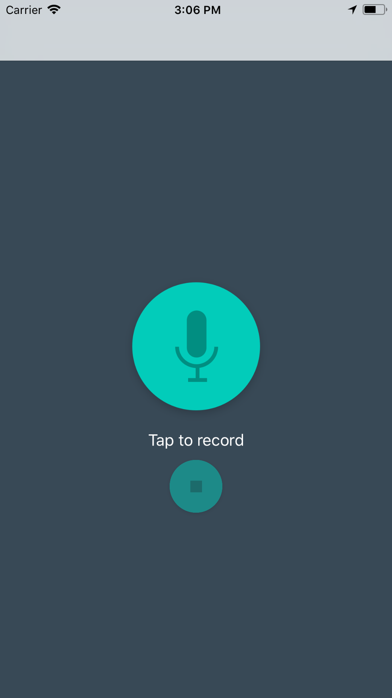

# Pitch Perfect
> Change your voice with diffrent filters.

(ss2.png)

## Build with

Swift version : 4
Xcode version : 9

## Usage example

Simpley run the app and record your voice with one click and boom...

## Release History

* 0.2.1
    * CHANGE: Update docs (module code remains unchanged)
* 0.2.0
    * CHANGE: Remove `setDefaultXYZ()`
    * ADD: Add `init()`
* 0.1.1
    * FIX: Crash when calling `baz()` (Thanks @GenerousContributorName!)
* 0.1.0
    * The first proper release
    * CHANGE: Rename `foo()` to `bar()`
* 0.0.1
    * Work in progress

## Meta

Kartik Patel – [@kartikpatel1910](https://twitter.com/KartikPatel1910) – patelkartik1910@gmail.com
[https://github.com/KartikPatelOfficial](https://github.com/KartikPatelOfficial)

## License

This project is licensed under the MIT License - see the [LICENSE.md](LICENSE.md) file for details

## Contributing

1. Fork it (<https://github.com/KartikPatelOfficial/PitchPerfect/fork>)
2. Create your feature branch (`git checkout -b feature/fooBar`)
3. Commit your changes (`git commit -am 'Add some fooBar'`)
4. Push to the branch (`git push origin feature/fooBar`)
5. Create a new Pull Request

[wiki]: https://github.com/KartikPatelOfficial/PitchPerfect/wiki
